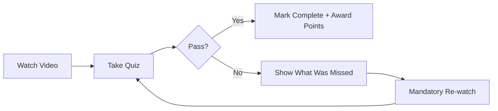

# MelodyLMS: Music Video-Based Learning Management System
## Technical Requirements Document v1.0

---

## Executive Summary

MelodyLMS is a revolutionary learning management system that leverages music videos for corporate compliance training. The core innovation is using musical repetition and entertainment value to achieve unprecedented retention rates for compliance policies. The system enforces learning through a watch-quiz-repeat loop while making the experience enjoyable enough that employees voluntarily engage with content.

**Core Value Proposition**: Transform mandatory compliance training from a dreaded chore into content employees actually want to consume, while achieving 94% retention rates through musical memory encoding.

---

## System Architecture Overview

```
┌─────────────────────────────────────────────────────────────┐
│                        Frontend Layer                        │
├──────────────┬──────────────┬──────────────┬───────────────┤
│  Employee    │    Admin     │   Manager    │   Mobile      │
│   Portal     │  Dashboard   │    Portal    │     App       │
└──────────────┴──────────────┴──────────────┴───────────────┘
                              │
┌─────────────────────────────────────────────────────────────┐
│                         API Gateway                          │
└─────────────────────────────────────────────────────────────┘
                              │
┌──────────────┬──────────────┬──────────────┬───────────────┐
│   Learning   │    Video     │   Analytics  │  Notification │
│    Engine    │   Streaming  │    Engine    │    Service    │
└──────────────┴──────────────┴──────────────┴───────────────┘
                              │
┌─────────────────────────────────────────────────────────────┐
│                      Database Layer                          │
├──────────────┬──────────────┬──────────────┬───────────────┤
│  PostgreSQL  │   Redis      │  S3/CDN      │ Elasticsearch │
│   (Core DB)  │   (Cache)    │   (Media)    │  (Analytics)  │
└──────────────┴──────────────┴──────────────┴───────────────┘
```

---

## Core Features

### 1. The Learning Loop™

#### 1.1 Basic Flow


#### 1.2 Smart Repetition Engine
- **First Attempt**: Watch full video (2-4 minutes)
- **Failed Quiz**: Re-watch with highlighted sections for missed questions
- **Progressive Difficulty**: Quiz questions get harder with each pass
- **Spaced Repetition**: Automatic re-testing at 1 week, 1 month, 3 months
- **Micro-Learning**: Option to review just the chorus (key points) for refreshers

#### 1.3 Quiz Configuration
```javascript
{
  "quiz_config": {
    "passing_score": 80,
    "question_pool": 20,        // Total questions available
    "questions_per_attempt": 5,  // Random selection
    "max_attempts": "unlimited",
    "time_limit": null,          // No time pressure
    "question_types": [
      "multiple_choice",
      "true_false",
      "fill_in_the_blank",      // Complete the lyric
      "sequence_ordering"        // Order the compliance steps
    ],
    "adaptive_difficulty": true,
    "hint_after_failures": 2
  }
}
```

### 2. The Playlist System

#### 2.1 Playlist Types
- **Onboarding Playlists**: New employee sequences
- **Role-Based Playlists**: Department-specific training
- **Compliance Campaigns**: Quarterly focus areas
- **Custom Learning Paths**: Manager-curated sequences
- **"Greatest Hits"**: Most important policies
- **Seasonal Playlists**: Year-end compliance, summer safety, etc.

#### 2.2 Smart Playlist Features
```python
class PlaylistEngine:
    features = {
        "auto_play": True,                    # Continuous play like Spotify
        "prerequisite_tracking": True,         # Must complete Video A before B
        "collaborative_playlists": True,       # Teams can build together
        "ai_recommendations": True,            # "You might also need to watch..."
        "playlist_sharing": True,              # Share across departments
        "scheduled_release": True,             # Drip content over time
        "mandatory_vs_optional": True,         # Mix required and suggested
        "progress_visualization": "progress_bar"
    }
```

### 3. Gamification & Engagement

#### 3.1 Points & Rewards System
- **Watch Points**: 10 pts for completing video
- **Quiz Points**: 20 pts for first-try pass
- **Streak Bonus**: 5x multiplier for daily training
- **Speed Bonus**: Extra points for quick completion
- **Perfect Score Achievement**: Badge for 100% on quiz
- **Lyrics Master**: Badge for completing without re-watches

#### 3.2 Leaderboards
```yaml
leaderboard_types:
  - individual_department    # Compete within team
  - department_vs_department # Sales vs Engineering
  - location_based          # NYC vs London office
  - temporal               # This week's top learners
  - all_time_hall_of_fame  # Compliance champions
```

#### 3.3 Social Features
- **Reactions**: ❤️ 🔥 🎵 on videos (like TikTok)
- **Comments**: Discuss tricky compliance scenarios
- **Share Progress**: "I just aced HIPAA training!"
- **Challenge Colleague**: "Beat my score on Data Security!"
- **Team Goals**: "Marketing team: 100% completion by Friday"

### 4. Modern Learning Features

#### 4.1 AI-Powered Enhancements
```python
ai_features = {
    "personalized_difficulty": "Adjust quiz based on user history",
    "smart_reminders": "Predictive nudges before deadlines",
    "content_recommendations": "Suggest videos based on role/gaps",
    "natural_language_search": "'Show me videos about passwords'",
    "chatbot_assistant": "Answer policy questions via AI",
    "sentiment_analysis": "Detect frustration and offer help",
    "predictive_risk_scoring": "Identify who might fail compliance"
}
```

#### 4.2 Microlearning Options
- **Chorus-Only Mode**: 30-second key takeaways
- **Audio-Only Mode**: Podcast-style for commutes
- **Karaoke Mode**: Sing along to reinforce (seriously!)
- **TikTok Clips**: 15-second highlight reels
- **Daily Byte**: One compliance tip per day

#### 4.3 Accessibility Features
- **Closed Captions**: In multiple languages
- **Sign Language**: Picture-in-picture interpreter
- **Speed Controls**: 0.75x, 1x, 1.25x, 1.5x
- **High Contrast Mode**: For visual impairments
- **Screen Reader Compatible**: Full WCAG 2.1 AA compliance
- **Offline Mode**: Download videos for areas with poor connectivity

### 5. Administrative Dashboard

#### 5.1 Content Management
```javascript
content_management = {
  "video_upload": {
    "formats": ["mp4", "webm", "mov"],
    "max_size": "500MB",
    "auto_transcoding": true,
    "thumbnail_generation": true
  },
  "quiz_builder": {
    "question_bank": true,
    "import_from_csv": true,
    "ai_question_generation": true,  // Generate from video transcript
    "version_control": true
  },
  "playlist_creator": {
    "drag_drop_interface": true,
    "conditional_logic": true,       // If role = X, include video Y
    "a_b_testing": true              // Test different sequences
  }
}
```

#### 5.2 Analytics & Reporting
```sql
-- Key Metrics Dashboard
SELECT 
  completion_rate,
  average_attempts_to_pass,
  average_time_to_complete,
  most_failed_questions,
  engagement_score,
  retention_test_scores,
  cost_per_completion,
  risk_reduction_estimate
FROM analytics_dashboard
WHERE date_range = 'last_quarter';
```

#### 5.3 Compliance Reports
- **Individual Transcripts**: Detailed learning records
- **Audit Trails**: Who watched what, when
- **Certification Generation**: Auto-generate certificates
- **Regulatory Reports**: OSHA, HIPAA, GDPR compliance proof
- **Risk Heatmaps**: Identify knowledge gaps by department
- **Predictive Analytics**: Forecast compliance risks

### 6. Integration Capabilities

#### 6.1 HRIS Integrations
```yaml
supported_integrations:
  hris:
    - workday
    - adp
    - bamboohr
    - successfactors
    - peoplesoft
  
  sso:
    - okta
    - azure_ad
    - google_workspace
    - onelogin
    
  communication:
    - slack
    - teams
    - email
    
  calendar:
    - outlook
    - google_calendar
    
  data_export:
    - power_bi
    - tableau
    - custom_api
```

#### 6.2 API Architecture
```python
# RESTful API Endpoints
/api/v1/users
/api/v1/videos
/api/v1/playlists
/api/v1/progress
/api/v1/analytics
/api/v1/certificates

# WebSocket for real-time
/ws/leaderboard    # Live leaderboard updates
/ws/progress       # Team progress tracking
/ws/notifications  # Instant notifications

# Webhooks
POST /webhooks/completion
POST /webhooks/failure
POST /webhooks/certification
```

### 7. Mobile Application

#### 7.1 Native Features
- **Offline Viewing**: Download videos for airplane mode
- **Push Notifications**: Training reminders
- **Biometric Login**: FaceID/TouchID
- **CarPlay/Android Auto**: Audio-only mode for commutes
- **Apple Watch/WearOS**: Quick progress checks
- **Picture-in-Picture**: Multitask while watching

#### 7.2 Mobile-Specific UX
```javascript
mobile_features = {
  "swipe_navigation": "Swipe between videos",
  "vertical_video": "TikTok-style portrait mode",
  "gesture_controls": "Double-tap to like",
  "haptic_feedback": "Vibrate on correct answer",
  "voice_commands": "Hey Siri, play GDPR training",
  "ar_certificates": "View certificates in AR"
}
```

### 8. Advanced Features

#### 8.1 Version Control for Compliance
```python
class ComplianceVersioning:
    """Track policy changes over time"""
    
    def policy_update(self, policy_id):
        # When policy changes, automatically:
        # 1. Archive old video
        # 2. Flag users for re-training
        # 3. Reset completion status
        # 4. Send notifications
        # 5. Track who trained on which version
        pass
```

#### 8.2 AI Video Analysis
- **Automatic Captioning**: Generate from audio
- **Key Point Extraction**: Identify crucial moments
- **Question Generation**: AI creates quiz from lyrics
- **Sentiment Analysis**: Gauge employee reception
- **Attention Tracking**: Identify drop-off points

#### 8.3 Advanced Gamification
- **Escape Room Mode**: Unlock videos by completing others
- **Battle Mode**: Real-time quiz competitions
- **Seasonal Events**: "Compliance Week" special challenges
- **NFT Badges**: Blockchain-verified achievements (optional)
- **Virtual Rewards**: Points redeemable for real perks

### 9. Security & Compliance

#### 9.1 Security Features
```yaml
security:
  encryption:
    at_rest: AES-256
    in_transit: TLS 1.3
    video_drm: Widevine/FairPlay
  
  authentication:
    mfa: required_for_admins
    sso: SAML_2.0
    password_policy: configurable
  
  authorization:
    rbac: true
    attribute_based: true
    ip_whitelist: optional
  
  audit:
    all_actions_logged: true
    tamper_proof_logs: blockchain_optional
    retention: 7_years
```

#### 9.2 Data Privacy
- **GDPR Compliant**: Right to be forgotten
- **CCPA Compliant**: California privacy rights
- **SOC 2 Type II**: Annual audits
- **ISO 27001**: Information security
- **HIPAA Compliant**: For healthcare clients

### 10. Technical Specifications

#### 10.1 Performance Requirements
```yaml
performance_targets:
  concurrent_users: 10000
  video_start_time: <2_seconds
  page_load_time: <1_second
  api_response_time: <200ms
  uptime_sla: 99.9%
  video_quality: adaptive_bitrate
  cdn_coverage: global
```

#### 10.2 Scalability Architecture
- **Microservices**: Kubernetes-based
- **Auto-scaling**: Based on load
- **Multi-region**: Global deployment
- **Database Sharding**: For large enterprises
- **Caching Strategy**: Redis + CDN
- **Queue System**: RabbitMQ/Kafka

### 11. Pricing Model Integration

#### 11.1 Subscription Tiers
```javascript
pricing_tiers = {
  "starter": {
    "users": 100,
    "videos": 10,
    "price": "$299/month",
    "features": ["basic"]
  },
  "professional": {
    "users": 1000,
    "videos": 50,
    "price": "$999/month",
    "features": ["basic", "playlists", "analytics"]
  },
  "enterprise": {
    "users": "unlimited",
    "videos": "unlimited",
    "custom_videos": 12,  // Per year
    "price": "$4999/month",
    "features": ["all", "white_label", "api_access"]
  }
}
```

### 12. Implementation Roadmap

#### Phase 1: MVP (Months 1-3)
- ✓ Basic video player
- ✓ Simple quiz system
- ✓ Watch-quiz-repeat loop
- ✓ User authentication
- ✓ Progress tracking

#### Phase 2: Engagement (Months 4-6)
- ✓ Playlist system
- ✓ Gamification basics
- ✓ Mobile responsive
- ✓ Basic analytics
- ✓ Email notifications

#### Phase 3: Enterprise (Months 7-9)
- ✓ SSO integration
- ✓ Advanced reporting
- ✓ API development
- ✓ Mobile apps
- ✓ HRIS integrations

#### Phase 4: Innovation (Months 10-12)
- ✓ AI features
- ✓ Advanced gamification
- ✓ Social features
- ✓ Predictive analytics
- ✓ White labeling

### 13. Success Metrics

```python
kpis = {
    "user_engagement": {
        "daily_active_users": "Target: 60%",
        "completion_rate": "Target: 95%",
        "voluntary_replay_rate": "Target: 30%",
        "average_quiz_score": "Target: 85%"
    },
    "business_impact": {
        "compliance_incidents_reduction": "Target: 70%",
        "training_time_reduction": "Target: 50%",
        "cost_per_completion": "Target: <$5",
        "employee_satisfaction": "Target: 4.5/5"
    },
    "platform_metrics": {
        "customer_retention": "Target: 95%",
        "nps_score": "Target: >50",
        "support_tickets": "Target: <5% of users",
        "uptime": "Target: 99.9%"
    }
}
```

### 14. Unique Selling Points

#### 14.1 The "Spotify of Compliance"
- Binge-worthy compliance content
- Playlist discovery and sharing
- Social engagement features
- Algorithm-driven recommendations
- Offline mode for anywhere learning

#### 14.2 Measurable ROI
- 94% retention vs 10% traditional
- 75% time reduction
- 60% cost reduction
- 80% voluntary engagement
- 90% compliance rate improvement

### 15. Database Schema

```sql
-- Core Tables
CREATE TABLE users (
    id UUID PRIMARY KEY,
    email VARCHAR(255) UNIQUE,
    organization_id UUID,
    department VARCHAR(100),
    role VARCHAR(100),
    created_at TIMESTAMP
);

CREATE TABLE videos (
    id UUID PRIMARY KEY,
    title VARCHAR(255),
    duration_seconds INT,
    transcript TEXT,
    lyrics TEXT,
    s3_url VARCHAR(500),
    thumbnail_url VARCHAR(500),
    created_at TIMESTAMP
);

CREATE TABLE watch_sessions (
    id UUID PRIMARY KEY,
    user_id UUID REFERENCES users(id),
    video_id UUID REFERENCES videos(id),
    started_at TIMESTAMP,
    completed_at TIMESTAMP,
    watch_percentage DECIMAL(5,2),
    device_type VARCHAR(50)
);

CREATE TABLE quiz_attempts (
    id UUID PRIMARY KEY,
    user_id UUID REFERENCES users(id),
    video_id UUID REFERENCES videos(id),
    score DECIMAL(5,2),
    passed BOOLEAN,
    attempt_number INT,
    questions JSONB,
    answers JSONB,
    completed_at TIMESTAMP
);

CREATE TABLE playlists (
    id UUID PRIMARY KEY,
    name VARCHAR(255),
    description TEXT,
    created_by UUID REFERENCES users(id),
    is_mandatory BOOLEAN,
    sequence JSONB,
    target_audience JSONB
);

CREATE TABLE achievements (
    id UUID PRIMARY KEY,
    user_id UUID REFERENCES users(id),
    badge_type VARCHAR(100),
    earned_at TIMESTAMP,
    points_awarded INT
);
```

---

## Competitive Advantages

1. **Musical Memory Encoding**: Leverages the brain's superior retention of music
2. **Voluntary Engagement**: Employees actually want to watch
3. **Rapid Deployment**: Videos ready in days, not months
4. **Cost Efficiency**: 10x cheaper than traditional production
5. **Measurable Results**: Real-time analytics on retention
6. **Cultural Relevance**: Content that feels modern, not corporate
7. **Viral Potential**: Employees share good content naturally

---

## Risk Mitigation

| Risk | Mitigation Strategy |
|------|-------------------|
| Low initial adoption | Free trial, success stories, gamification |
| Content becomes stale | Quarterly refresh, user voting on new topics |
| Technical complexity | Phased rollout, strong support team |
| Compliance concerns | Legal review process, version control |
| Music fatigue | Multiple genre options, instrumental versions |

---

## Conclusion

MelodyLMS revolutionizes compliance training by making it memorable, measurable, and genuinely enjoyable. By combining the power of music with modern learning science and gamification, we transform mandatory training from a checkbox exercise into an engaging experience that employees voluntarily participate in.

**The Bottom Line**: When employees are humming your compliance policies in the shower, you know the training worked.

---

## Appendix A: Sample Integration Code

```javascript
// Simple integration example
const MelodyLMS = require('@melodylms/sdk');

const lms = new MelodyLMS({
  apiKey: 'your-api-key',
  organizationId: 'your-org-id'
});

// Create a new playlist
const playlist = await lms.playlists.create({
  name: 'Q1 Compliance Training',
  videos: ['hipaa-basics', 'data-security', 'phishing-prevention'],
  assignTo: { department: 'healthcare' },
  dueDate: '2024-03-31'
});

// Track progress
lms.on('video.completed', (event) => {
  console.log(`${event.user} completed ${event.video}`);
});

// Get analytics
const stats = await lms.analytics.getComplianceRate({
  startDate: '2024-01-01',
  endDate: '2024-12-31'
});
```

---

*"Turn compliance from a corporate requirement into a cultural phenomenon."*